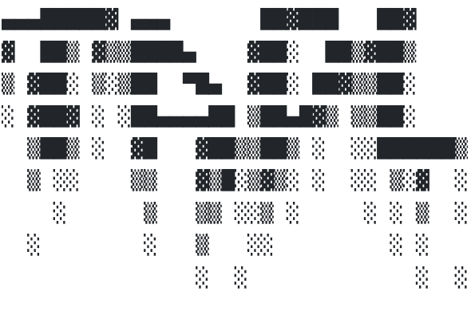

# Name

tapl, short stand for [Types and Programming Languages](http://www.cis.upenn.edu/~bcpierce/tapl/).

## Building

```
make all
```

## Running

```
make bot target=test
```

## Book Contents

### Preface x

* 1 Introduction 1
* 2 Mathematical Preliminaries 15

### I Untyped Systems 21

* [3 Untyped Arithmetic Expressions 23 (arith)](tapl/arith/README.md)
* [4 An ML Implementation of Arithmetic Expressions 45 (arith)](tapl/arith/README.md)
* [5 The Untyped Lambda-Calculus 51 (fulluntyped)](tapl/fulluntyped/README.md)
* [6 Nameless Representation of Terms 75 (fulluntyped)](tapl/fulluntyped/README.md)
* [7 An ML Implementation of the Lambda-Calculus 83 (untyped)](tapl/untyped/README.md) and [fulluntyped](tapl/fulluntyped/README.md)

### II Simple Types 89

* [8 Typed Arithmetic Expressions 91 (tyarith)](tapl/tyarith/README.md)
* [9 Simply Typed Lambda-Calculus 99 (fullsimple)](tapl/fullsimple/README.md)
* [10 An ML Implementation of Simple Types 113 (simplebool)](tapl/simplebool/README.md)
* [11 Simple Extensions 117 (fullsimple)](tapl/fullsimple/README.md) and [letexercise](tapl/letexercise/README.md)
* 12 Normalization 149
* [13 References 153 (fullref)](tapl/fullref/README.md)
* [14 Exceptions 171 (fullerror)](tapl/fullerror/README.md)

### III Subtyping 179

* [15 Subtyping 181 (fullsub)](tapl/fullsub/README.md) and [rcdsubbot](tapl/rcdsubbot/README.md)
* [16 Metatheory of Subtyping 209 (rcdsubbot)](tapl/rcdsubbot/README.md) and [bot](tapl/bot/README.md)
* 17 An ML Implementation of Subtyping 221
* [18 Case Study: Imperative Objects 225 (fullref)](tapl/fullref/README.md)
* 19 Case Study: Featherweight Java 247

### IV Recursive Types 265

* [20 Recursive Types 267 (fullisorec)](tapl/fullisorec/README.md) and [fullequirec](tapl/fullequirec/README.md)
* [21 Metatheory of Recursive Types 281 (equirec)](tapl/equirec/README.md)

### V Polymorphism 315

* [22 Type Reconstruction 317 (recon)](tapl/recon/README.md) and [fullrecon](tapl/fullrecon/README.md) and [reconbase](tapl/reconbase/README.md)
* [23 Universal Types 339 (fullpoly)](tapl/fullpoly/README.md) and [fullomega](tapl/fullomega/README.md)
* [24 Existential Types 363 (fullpoly)](tapl/fullpoly/README.md)
* 25 An ML Implementation of System F 381
* [26 Bounded Quantification 389 (fullfsub)](tapl/fullfsub/README.md) and [fullfomsub](tapl/fullfomsub/README.md)
* [27 Case Study: Imperative Objects, Redux 411 (fullfsub)](tapl/fullfsub/README.md)
* [28 Metatheory of Bounded Quantification 417 (fullfsub)](tapl/fullfsub/README.md) and [purefsub](tapl/purefsub/REDME.md)

### VI Higher-Order Systems 437

* [29 Type Operators and Kinding 439 (fullomega)](tapl/fullomega/README.md)
* [30 Higher-Order Polymorphism 449 (fomega)](tapl/fomega/README.md) and [fullomega](tapl/fullomega/README.md)
* [31 Higher-Order Subtyping 467 (fomsub)](tapl/fomsub/README.md) and [fullfomsub](tapl/fullfomsub/README.md)
* [32 Case Study: Purely Functional Objects 475 (fullupdate)](tapl/fullupdate/README.md)


